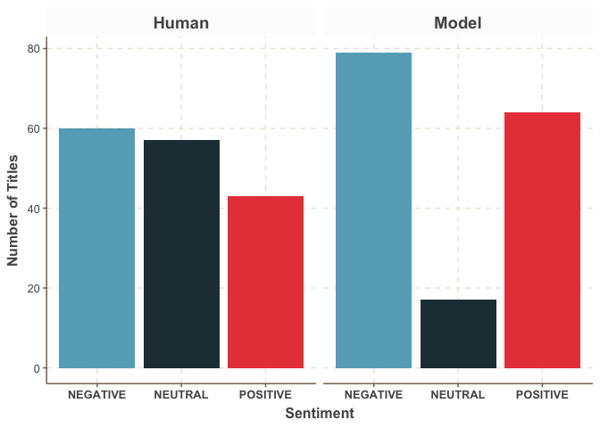
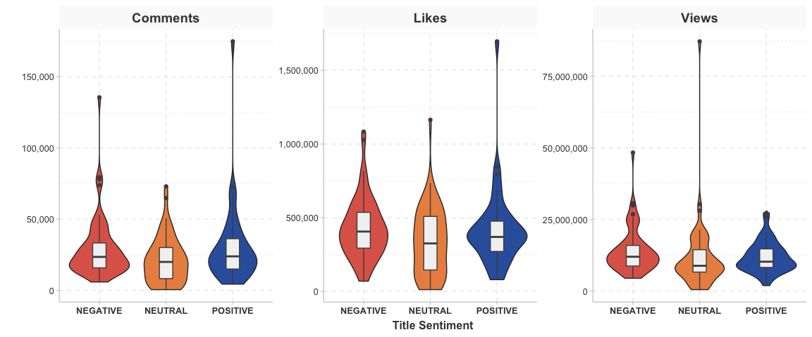
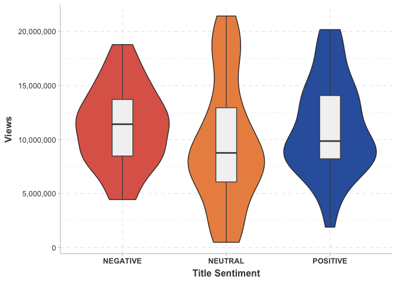
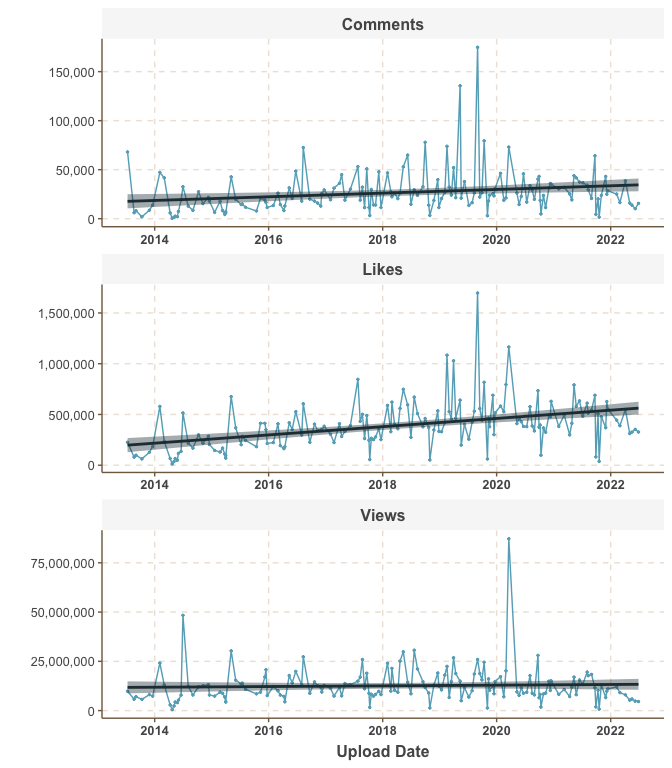
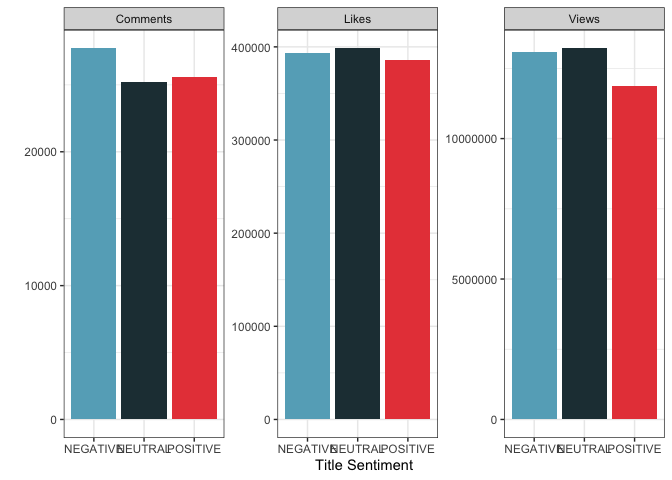
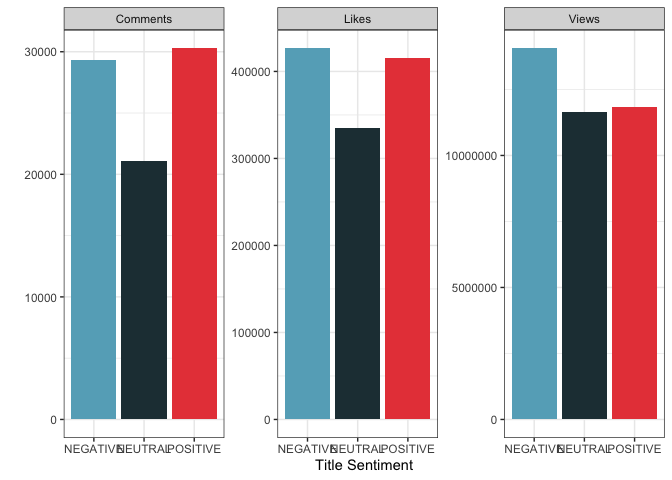
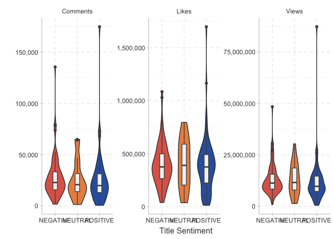

The Sky is Falling
================

### The impact of title sentiment on the success of scientific YouTube content

``` r
library(tidyverse)
library(RPostgreSQL)
library(dotenv)
library(ggthemes)
library(ggthemr)
library(plotly)
library(formattable)

#securely loading credentials
load_dot_env(file = ".env")

#building a trycatch function for database connection
db_connect <- function(drv, host, port, dbname, user, password){
  tryCatch(
    dbConnect(drv=drv, host=host, port=port, dbname = dbname, user=user, password=password),
    error = function(e){
      print("Could not connect!") 
      print(e)
      },
    finally = {
      print("Connected!")
      }
  )
}

options(scipen = 999)
#connecting to the database
con <- db_connect(PostgreSQL(), host = Sys.getenv("ENDPOINT"),  port = Sys.getenv("PORT") , dbname = Sys.getenv("DB_NAME"), user = Sys.getenv("USERNAME"), password = Sys.getenv("PASSWORD"))
```

    ## [1] "Connected!"

This is a followup on the NLP sentiment analysis on the titles for
Kurzgesagt YouTube videos. In order to see how successful that sentiment
analysis was, I will classify the titles manually and check to see how
frequently the model agreed with my classifications.

``` r
video_data <- collect(tbl(con, "video_data")) #collecting data from database to my system

#my sentiment ratings for the video titles
my_ratings <- c(-1, 1, 0, -1, 1, 0, -1, -1, 0, 0, 1, 0, 0, 1, 1, 0, 0, 0, 1, -1,-1, -1, -1, 0, -1, -1, -1, 1, -1, 0, -1, 0, 1, -1, 0, 1, 1, 0, 0, 0, -1, 0, 1, 0, 1, 0, -1, 0, -1, 1, 1, 1, 0, -1, -1, 0, 1, -1, -1, -1, -1, 0, -1, -1, -1, 1, 0, -1, 1, 0, 1, 1, -1, 0, 1, -1, 1, 0, -1, -1, 0, -1, -1, 1, 0, 0, -1, -1, -1, 1, 1, 1, 1, 0, -1, 0, -1, -1, -1, 1, 0, -1, 0, 0, 0, -1, -1, 1, -1, 1, -1, 0, 1, -1, 1, 1, 1, -1, 1, -1, -1, -1, 1, 0, 0, -1, 1, 0, -1, -1, 1, 0, 1, -1, 0, 0, -1, 0, 1, 0, -1, 0, 0, 0,-1, -1, 0, 0, 0, 0, 0, 0, 1, -1, 0, 0, 0, -1, 1, 1) %>% as.character

my_ratings <- my_ratings %>%
  replace( my_ratings == "-1", "NEGATIVE") %>%
  replace(my_ratings == "0", "NEUTRAL") %>%
  replace(my_ratings == "1", "POSITIVE") 

video_data <- cbind(video_data, my_ratings)
video_data <- video_data %>%
  mutate(upload_date = as.Date(upload_date))
```

To check if the sentiment analysis model agrees with my assessment, I
will first check the proportion of time that my title ratings matched
the sentiment ratings of the model, and then I will filter out all
“NEUTRAL” titles and repeat the process.

``` r
test1 <- video_data$title_sentiment == video_data$my_ratings
mean(test1)
```

    ## [1] 0.55

``` r
#the model agreed with my rankings only 55% of the time

test2 <- video_data %>%
  filter(title_sentiment != "NEUTRAL" & my_ratings != "NEUTRAL") %>%
  mutate(test = ifelse(title_sentiment == my_ratings, 1, 0))
mean(test2$test)
```

    ## [1] 0.8510638

``` r
#but if I remove neutral titles, it agrees with my rankings 85% of the time
```

When comparing directly, the model only agreed with my rankings 55% of
the time, but when removing all “NEUTRAL” titles, the model agreed with
my rankings 85% of the time (which is pretty good!). The issue is that
the sentiment analysis model is really only designed to classify things
as “POSITIVE” or “NEGATIVE”. When I added the neutral class in the
sentiment analysis, it was based on when the model had low certainty of
either positive or negative, but it still wasn’t enough to really
capture neutral as a category. A way to improve this would be to train
our own sentiment analysis model on a much larger set of video titles,
which may be a longer-term project.

``` r
ggthemr(palette = "fresh" ,layout = "pastel")
video_data %>%
  select(title_sentiment, my_ratings)%>%
  pivot_longer(cols = c("title_sentiment", "my_ratings"))%>%
  mutate( `Sentiment Source` = ifelse(name == "title_sentiment", "Model", "Human")) %>%
  ggplot(aes(x = value, fill = value))+
  geom_bar()+
  labs(x = 'Sentiment', y = "Number of Titles")+
  theme(strip.text.x = element_text(size = 14, face = "bold"), 
        strip.background = element_rect(fill = "grey99"), axis.text.x = element_text(face = "bold"), 
        axis.title = element_text(face = "bold"), legend.position = "none")+
  facet_wrap(~`Sentiment Source`)
```

<!-- -->

As seen from the above visualization, the main difference between the
model classifications and human classifications is that the model
allocated a large portion of titles which I ranked as “NEUTRAL” to
either the “POSITIVE” or “NEGATIVE” categories.

A benefit of the sentiment analysis method is that it is not subject to
personal bias - it has ranked certain words and collections of words as
being associated with negative statements and some as being associated
with positive statements. This is consistent even if it sometimes misses
nuance. My own assessment of title sentiment is based on my subjective
interpretation, which may change between evaluations. Both methods have
pros and cons.

Now, doing some exploratory data analysis, I’d like to look at which
titles are associated with the highest like, view, and comment counts.

``` r
#Top 10 titles for views
video_data %>%  
  arrange(desc(view_count)) %>%
  rename(Title = vid_title, Views = view_count, `Sentiment (Modeled)` = title_sentiment) %>%
  select(Title,Views, `Sentiment (Modeled)`) %>%
  filter(Views >= Views[10]) %>%
  formattable()
```

<table class="table table-condensed">
<thead>
<tr>
<th style="text-align:right;">
Title
</th>
<th style="text-align:right;">
Views
</th>
<th style="text-align:right;">
Sentiment (Modeled)
</th>
</tr>
</thead>
<tbody>
<tr>
<td style="text-align:right;">
The Coronavirus Explained & What You Should Do
</td>
<td style="text-align:right;">
87197319
</td>
<td style="text-align:right;">
POSITIVE
</td>
</tr>
<tr>
<td style="text-align:right;">
The Immune System Explained I – Bacteria Infection
</td>
<td style="text-align:right;">
48352046
</td>
<td style="text-align:right;">
NEGATIVE
</td>
</tr>
<tr>
<td style="text-align:right;">
What If You Detonated a Nuclear Bomb In The Marianas Trench? (Science
not Fantasy)
</td>
<td style="text-align:right;">
30639849
</td>
<td style="text-align:right;">
NEGATIVE
</td>
</tr>
<tr>
<td style="text-align:right;">
The Fermi Paradox — Where Are All The Aliens? (1/2)
</td>
<td style="text-align:right;">
30323863
</td>
<td style="text-align:right;">
NEUTRAL
</td>
</tr>
<tr>
<td style="text-align:right;">
The Deadliest Being on Planet Earth – The Bacteriophage
</td>
<td style="text-align:right;">
29879811
</td>
<td style="text-align:right;">
NEGATIVE
</td>
</tr>
<tr>
<td style="text-align:right;">
The Largest Star in the Universe – Size Comparison
</td>
<td style="text-align:right;">
28015792
</td>
<td style="text-align:right;">
NEGATIVE
</td>
</tr>
<tr>
<td style="text-align:right;">
Genetic Engineering Will Change Everything Forever – CRISPR
</td>
<td style="text-align:right;">
27313561
</td>
<td style="text-align:right;">
POSITIVE
</td>
</tr>
<tr>
<td style="text-align:right;">
What If We Detonated All Nuclear Bombs at Once?
</td>
<td style="text-align:right;">
26815546
</td>
<td style="text-align:right;">
NEGATIVE
</td>
</tr>
<tr>
<td style="text-align:right;">
The Egg - A Short Story
</td>
<td style="text-align:right;">
25943327
</td>
<td style="text-align:right;">
POSITIVE
</td>
</tr>
<tr>
<td style="text-align:right;">
Why Black Holes Could Delete The Universe – The Information Paradox
</td>
<td style="text-align:right;">
25900677
</td>
<td style="text-align:right;">
NEGATIVE
</td>
</tr>
</tbody>
</table>

``` r
#Top 10 titles for comments
video_data %>%  
  arrange(desc(comment_count)) %>%
  rename(Title = vid_title, Comments = comment_count, `Sentiment (Modeled)` = title_sentiment) %>%
  select(Title,Comments,`Sentiment (Modeled)` ) %>%
  filter(Comments >= Comments[10]) %>%
  formattable()
```

<table class="table table-condensed">
<thead>
<tr>
<th style="text-align:right;">
Title
</th>
<th style="text-align:right;">
Comments
</th>
<th style="text-align:right;">
Sentiment (Modeled)
</th>
</tr>
</thead>
<tbody>
<tr>
<td style="text-align:right;">
The Egg - A Short Story
</td>
<td style="text-align:right;">
174858
</td>
<td style="text-align:right;">
POSITIVE
</td>
</tr>
<tr>
<td style="text-align:right;">
The Side Effects of Vaccines - How High is the Risk?
</td>
<td style="text-align:right;">
135582
</td>
<td style="text-align:right;">
NEGATIVE
</td>
</tr>
<tr>
<td style="text-align:right;">
What if We Nuke a City?
</td>
<td style="text-align:right;">
79458
</td>
<td style="text-align:right;">
NEGATIVE
</td>
</tr>
<tr>
<td style="text-align:right;">
Why Meat is the Best Worst Thing in the World 🍔
</td>
<td style="text-align:right;">
77925
</td>
<td style="text-align:right;">
NEGATIVE
</td>
</tr>
<tr>
<td style="text-align:right;">
Loneliness
</td>
<td style="text-align:right;">
73861
</td>
<td style="text-align:right;">
NEGATIVE
</td>
</tr>
<tr>
<td style="text-align:right;">
The Coronavirus Explained & What You Should Do
</td>
<td style="text-align:right;">
73033
</td>
<td style="text-align:right;">
POSITIVE
</td>
</tr>
<tr>
<td style="text-align:right;">
Genetic Engineering Will Change Everything Forever – CRISPR
</td>
<td style="text-align:right;">
72593
</td>
<td style="text-align:right;">
POSITIVE
</td>
</tr>
<tr>
<td style="text-align:right;">
How Evolution works
</td>
<td style="text-align:right;">
68072
</td>
<td style="text-align:right;">
POSITIVE
</td>
</tr>
<tr>
<td style="text-align:right;">
3 Arguments Why Marijuana Should Stay Illegal Reviewed
</td>
<td style="text-align:right;">
64887
</td>
<td style="text-align:right;">
NEUTRAL
</td>
</tr>
<tr>
<td style="text-align:right;">
Can YOU Fix Climate Change?
</td>
<td style="text-align:right;">
64154
</td>
<td style="text-align:right;">
NEUTRAL
</td>
</tr>
</tbody>
</table>

``` r
#Top 10 titles for likes
video_data %>%  
  arrange(desc(like_count)) %>%
  rename(Title = vid_title, Likes = like_count, `Sentiment (Modeled)` = title_sentiment) %>%
  select(Title,Likes, `Sentiment (Modeled)`) %>%
  filter(Likes >= Likes[10]) %>%
  formattable()
```

<table class="table table-condensed">
<thead>
<tr>
<th style="text-align:right;">
Title
</th>
<th style="text-align:right;">
Likes
</th>
<th style="text-align:right;">
Sentiment (Modeled)
</th>
</tr>
</thead>
<tbody>
<tr>
<td style="text-align:right;">
The Egg - A Short Story
</td>
<td style="text-align:right;">
1696596
</td>
<td style="text-align:right;">
POSITIVE
</td>
</tr>
<tr>
<td style="text-align:right;">
The Coronavirus Explained & What You Should Do
</td>
<td style="text-align:right;">
1164510
</td>
<td style="text-align:right;">
POSITIVE
</td>
</tr>
<tr>
<td style="text-align:right;">
Loneliness
</td>
<td style="text-align:right;">
1084372
</td>
<td style="text-align:right;">
NEGATIVE
</td>
</tr>
<tr>
<td style="text-align:right;">
What If We Detonated All Nuclear Bombs at Once?
</td>
<td style="text-align:right;">
1029050
</td>
<td style="text-align:right;">
NEGATIVE
</td>
</tr>
<tr>
<td style="text-align:right;">
Optimistic Nihilism
</td>
<td style="text-align:right;">
845637
</td>
<td style="text-align:right;">
POSITIVE
</td>
</tr>
<tr>
<td style="text-align:right;">
What if We Nuke a City?
</td>
<td style="text-align:right;">
817235
</td>
<td style="text-align:right;">
NEGATIVE
</td>
</tr>
<tr>
<td style="text-align:right;">
Why Blue Whales Don’t Get Cancer - Peto’s Paradox
</td>
<td style="text-align:right;">
794857
</td>
<td style="text-align:right;">
NEUTRAL
</td>
</tr>
<tr>
<td style="text-align:right;">
TRUE Limits Of Humanity – The Final Border We Will Never Cross
</td>
<td style="text-align:right;">
790964
</td>
<td style="text-align:right;">
POSITIVE
</td>
</tr>
<tr>
<td style="text-align:right;">
The Deadliest Being on Planet Earth – The Bacteriophage
</td>
<td style="text-align:right;">
747937
</td>
<td style="text-align:right;">
NEGATIVE
</td>
</tr>
<tr>
<td style="text-align:right;">
The Largest Star in the Universe – Size Comparison
</td>
<td style="text-align:right;">
734213
</td>
<td style="text-align:right;">
NEGATIVE
</td>
</tr>
</tbody>
</table>

The video with the most views (by almost double the next highest) is an
explanatory video which is discussing Coronavirus and mthods of
mitigation. Interestingly, the video with the most likes and comments
was not the video that had the most views (it had the 9th most). This
video is called “The Egg - A Short Story”, and is a non-scientific,
hopeful and philosophical video that is not typical for this channel.
This suggests that occasional deviations from your channel’s main focus
can still drive very high levels of positive engagement.

Some data visualization

``` r
ggthemr(palette = "pale", layout = "scientific")
#box plots of human data for likes, comments and views


video_data %>%
  select(view_count, like_count, comment_count, my_ratings) %>%
  rename(Views = view_count, Likes = like_count, Comments = comment_count)%>%
  pivot_longer(cols = c("Views", "Likes", "Comments")) %>%
  ggplot(aes(x = my_ratings, y = value))+
  geom_violin(aes(fill = my_ratings))+
  geom_boxplot(width = .2, fill = "grey95", color = "grey30")+
  theme(legend.position = "none",strip.text.x = element_text(size = 14, face = "bold"), 
        axis.text.x = element_text(face = "bold"), strip.background = element_rect(fill = "grey98"), 
        axis.title.x = element_text(face = "bold"))+
  scale_y_continuous(labels = scales::comma)+
  labs(x = "Title Sentiment", y = "", color = "")+
  facet_wrap(~name, scales = "free")
```

<!-- -->

The way to interpret this plot is that the “violin” part shows the
distribution of the data (bigger bulge where there are more data points)
and the boxplot shows the median (bar in the middle) and first/third
quartile. Comments, likes, and views are all higher for videos with
negative titles. This would suggest that a more negative title is having
at least some positive effect on the amount of engagement with a video.
In order to take a closer look at this, I will next look at views in
isolation, this time filtering out any outliers.

``` r
ggthemr(palette = "pale", layout = "scientific")
#box and violin plot of just views with outliers removed
views_by_sentiment <- video_data %>%
  select(view_count, my_ratings) %>%
  rename(Views = view_count)%>%
  filter(Views <= 2.2e7) %>%
  ggplot(aes(x = my_ratings, y = Views))+
  geom_violin(aes(fill = my_ratings))+
  geom_boxplot(width = .2, fill = "grey95", color = "grey30")+
  scale_y_continuous(labels = scales::comma)+
  theme(legend.position = "none",  axis.text.x = element_text(face = "bold"), 
        axis.title = element_text(face = "bold"))+
  labs(x = "Title Sentiment", y = "Views", color = "")

views_by_sentiment
```

<!-- -->

From these visualizations it appears that a more negative title yields
more views on average. Both median and mean views are higher when the
title is negative. Further analysis in th

Next, it would be nice to examine if there has been a change in views,
comments, or likes throughout the history of the channel.

``` r
ggthemr(palette = "fresh")
timeseries <- video_data %>%
  select(vid_title, view_count, like_count, comment_count, upload_date) %>%
  rename(Views = view_count, Likes = like_count, Comments = comment_count)%>%
  pivot_longer(cols = c("Views", "Likes", "Comments")) %>%
  ggplot( aes(x = upload_date, y = value))+
  geom_point(size = .5)+
  geom_line()+
  geom_smooth(method = "lm")+
  facet_wrap(~name, scale = "free", ncol = 1)+
  labs(x = "Upload Date", y = "")+
  scale_y_continuous(labels = scales::comma)+
  theme(strip.text.x = element_text(size = 12, face = "bold"), 
        strip.background = element_rect(fill = "grey97"), axis.text.x = element_text(face = "bold"), 
        axis.title.x = element_text(face = "bold"))

timeseries
```

    ## `geom_smooth()` using formula 'y ~ x'

<!-- -->

Views have been pretty constant through time, but likes and comments
have increased notably over time. This might give some insight into how
viewers are engaging with the videos - with new viewers liking and
commenting on newer videos, and then more passively engaging with older
content as they go back through the back catalogue of videos.

If you would like an interactive version of this plot, simply uncomment
and run the following:

``` r
#interactive version
#ggplotly(timeseries)
```

Abandoned plots———————————

``` r
#column plot of mean likes, views, and comments for different title sentiments (model)
video_data %>%
  select(view_count, like_count, comment_count, title_sentiment) %>%
  group_by(title_sentiment)%>%
  summarize(Views = mean(view_count), Likes = mean(like_count), Comments = mean(comment_count)) %>%
  pivot_longer(cols = c("Views", "Likes", "Comments")) %>%
  ggplot(aes(x = title_sentiment, y = value, fill = title_sentiment))+
  geom_col()+
  theme_bw()+
  theme(legend.position = "none")+
  labs(x = "Title Sentiment", y = "", color = "")+
  facet_wrap(~name, scales = "free")
```

<!-- -->

``` r
#column plot of mean likes, views, and comments for different title sentiments (human)
video_data %>%
  select(view_count, like_count, comment_count, my_ratings) %>%
  group_by(my_ratings)%>%
  summarize(Views = mean(view_count), Likes = mean(like_count), Comments = mean(comment_count)) %>%
  pivot_longer(cols = c("Views", "Likes", "Comments")) %>%
  ggplot(aes(x = my_ratings, y = value, fill = my_ratings))+
  geom_col()+
  theme_bw()+
  theme(legend.position = "none")+
  labs(x = "Title Sentiment", y = "", color = "")+
  facet_wrap(~name, scales = "free")
```

<!-- -->

``` r
#violin plot of model data
ggthemr(palette = "pale", layout = "scientific")
video_data %>%
  select(view_count, like_count, comment_count, title_sentiment) %>%
  rename(Views = view_count, Likes = like_count, Comments = comment_count)%>%
  pivot_longer(cols = c("Views", "Likes", "Comments")) %>%
  ggplot(aes(x = title_sentiment, y = value))+
  geom_violin(aes(fill = title_sentiment))+
  geom_boxplot(width = .2, fill = "grey95", color = "grey30")+
  theme(legend.position = "none")+
  labs(x = "Title Sentiment", y = "", color = "")+
  scale_y_continuous(labels = scales::comma)+
  facet_wrap(~name, scales = "free")
```

<!-- -->
